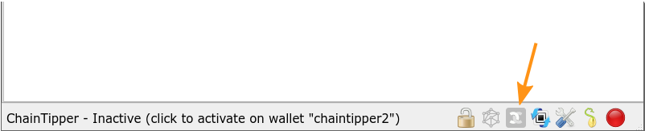
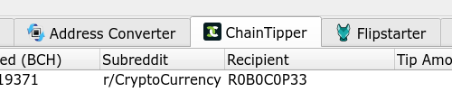
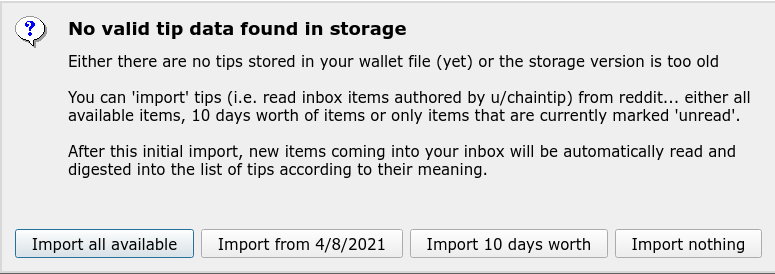
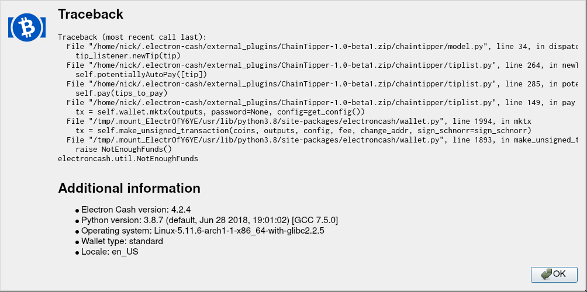

# ChainTipper User Manual

## A note about Safety and Security - MUST READ

Electron Cash Plugin security model is abysmal: a plugin has access to everything inside EC and also all your system stuff like the filesystem.

This means that you have to trust the author of the plugin. Source code for ChainTipper is included in the distribution ZIP file and will be found together with necessary build tools on github (or similar site). Please see [Building and Reviewing](../build_review.md]) for more info.

> As a precationary measure, you are also advised to use a separate wallet for ChainTipper that contains only funds you are prepared to lose. This is to protect against bugs possibly overpaying.

## General Overview and Mode of Operation

ChainTipper is a Electron Cash Plugin to (semi-)automatically pay chaintip tips you make on Reddit.

To do this, ChainTipper connects to Reddit (you authorize it to do so) and reads items from your inbox (it will see both historical unread items and new ones coming in live).

It then parses any private message authored by `/u/chaintip` to see if it's a message telling you payment details about a tip you made.

ChainTipper will get the linked Tip comment (the one you wrote) and parse a payment amount fromatted `/u/chaintip <amount> <unit>`.

### Installation

ChainTipper is an external Electron-Cash Plugin.

To install it, start Electron Cash, then go to `Tools` -> `Installed Plugins`. Use the `Add Plugin` button and locate ChainTipper-x.y-z.zip from your filesystem.

> Note: When updating, you might have to uninstall the previously installed plugin and then potentially even **restart Electron-Cash**.

### Running with debug output

To see debug output (and be able to copy it later) you can start Electron Cash from a terminal ("cmd" on windows, "terminal" or similar on linux) with the `-v` (verbose) flag. Try drag & dropping the executable file to the terminal window, then add a space and the `-v` flag, then hit `enter`. 

For convenience you can add `-w <wallet file name>` to directly open a specific wallet.

### Activating ChainTipper on a wallet

ChainTipper can run a separate instance of itself per wallet. This means you can even have multiple ChainTipper instances connected to different reddit accounts and each connected to its own wallet.

> Note: You are strongly advised to use a separate wallet for ChainTipper. Currently ChainTipper handles only standard wallets without a password. Do not put more money into that wallet than you are prepared to lose.

ChainTipper is accessed through an icon in the bottom Status Bar of a wallet window:



Left-clicking the icon will enable / disable ChainTipper on that wallet.

Right-clicking the icon will open the ChainTipper menu.

Once active, ChainTipper will open a tab in the wallet window called `ChainTipper`:



### Authorizing ChainTipper to access your reddit data.

On first activation (on each wallet), ChainTipper will ask you to authorize it to access your reddit data. To do this it will open your systems web browser to a page on reddit allowing you to authorize ChainTip. 

After clicking `Allow` on that page, the plugin should receive an authorization token from your browser (it listens on localhost:18763 and the browser will be redirected there by reddit).

This token will be stored inside your wallet file so subsequent activations of ChainTipper should not require any more authorizations from you.

To remove authorization token from your wallet (i.e. disconnect reddit account from wallet), use ChainTipper menu item `Forget Reddit Authorization`

To revoke the authorization go to https://reddit.com/prefs/apps.

### Initial import of data from Reddit

ChainTipper stores information about tips in your wallet file. If no such dataset is found (or its format is outdated), ChainTipper will prompt you to import historical data from Reddit Messages and Comments:



There are different option to choose regarding how much data should be imported.

> Note: Depending on your choice and the amount of tips you made in the past, the **import process can take a long time** and inconveniently, the **gui is locked** during the import while the status bar shows the text "importing...". There is no progress indication, but if you suspect it hangs, you can look on the console (see below how to start with `-v` flag) to see wether ChainTipper is digesting Reddit data.

This is a one-time process. After initial import, the data is stored in the wallet file.

Should you for any reason want to re-do this import process, you can: select all tips, right-click on the selection, choose `remove`, then deactivate and re-activate ChainTipper using the status bar icon.

### The TipList

When ChainTipper is active a `ChainTipper` tab is shown in the window of the respective wallet:


The List shows one item per private message from `/u/chaintip` that was read from Reddit.

Here's a list of the columns and their meaning:

 * **Date**: Timestamp of the Chaintip Message
 * **Acceptance**: Reflects Status of the Tip as derived from the various messages u/chaintip sent. The following states are possible:
   * **linked**: the tipee has already registered an address with chaintip. This is a final state.
   * **not yet linked**: the tipee has not yet registered their wallet with chaintip. From here the status can transition to
   * **claimed**: the tipee has claimed your tip by registering an address with chaintip (onboarding success)
   * **returned**: the tipee failed to claim your tip and it was returned to the address you registered with chaintip

### Tip actions

Right-clicking an item in the TipList will bring up a context-menu that allows executing actions on the item. It's also possible to select multiple items (using `shift` and/or `ctrl` modifiers and a left mouse button click)

 * **mark read**: marks the corresponding chaintip messages as `read` on reddit. Note that the item(s) will disappear after you've marked them as read in this way.
 * **pay...**: open Send tab with `Pay to` filled out to reflect the currently selected list of items.
 * **open browser to tipping comment**: opens a webprowser to the permlink of your comment that triggered chaintip

### Specifying an amount in your Tip comment

ChainTipper looks up your comment that triggered chaintip to send you a message and parses that for something matching the following pattern:

```
/u/chaintip <amount> <unit>
```

> Known issue: the leading `/` is currently necessary. Will be fixed soon

What exactly you can use for `<amount>` and `<unit>` can be seen by selecting `Show Amount Monikers` in the ChainTip menu.


#### Parser fail => Default Tip Amount

If the parser fails to find above pattern (for example because you didn't spedify an amount), the `default amount` (configurable in settings, see below) will be used to set the tip amount. 

### AutoTip

TODO

### Settings

TODO

### Handling and Reporting Errors

Especially during the beta, getting error reports to the developers is important.

On fatal Exceptions Electron Cash will show a Error Report Dialog saying `Sorry, something went wrong`. Please **DO NOT** currently use the `Send Bug Report` button, because that will result in an issue being openend in the Electron Cash github. I'm trying to find a way to route the reports to me somehow, but for now, just screenshot or copypaste what is shown when you click `show report contents` and send it to the dev.

Some less fatal errors / problems do not reach this dialog. They can only be seen on the stdout when you start EC from a terminal like described further up in Section "Running with debug output"



## Random Tips & Tricks

 * When you "mark unread" a message in reddit, it will be picked up by ChainTipper
 * There is a setting in reddit user preferences to disable automatically marking messages as read when visiting the inbox.

