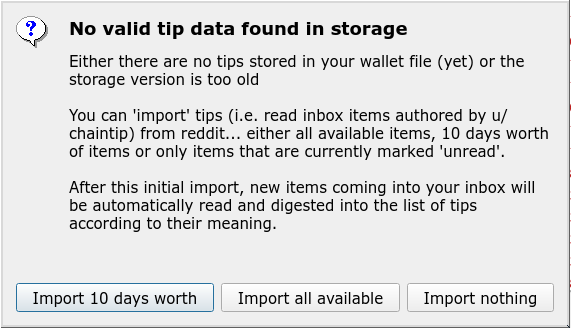
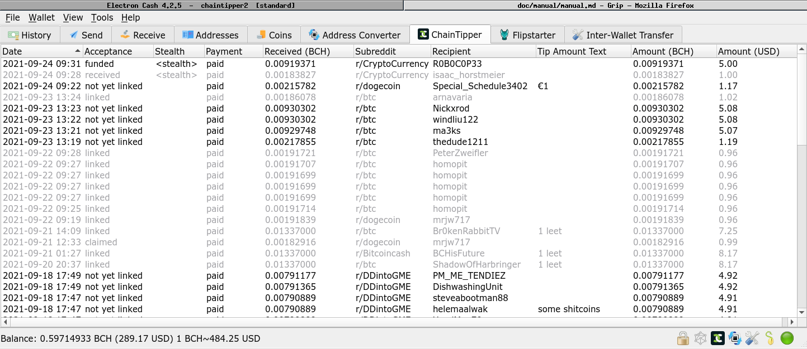
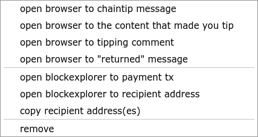

# ChainTipper User Manual

## A note about Safety and Security - MUST READ

Electron Cash Plugin security model is abysmal: a plugin has access to everything inside EC and also all your system stuff like the filesystem.

This means that you have to trust the author of the plugin. Source code for ChainTipper is included in the distribution ZIP file and will be found together with necessary build tools on github (or similar site). Please see [Building and Reviewing](../build_review.md]) for more info.

> As a precationary measure, you are also advised to use a separate wallet for ChainTipper that contains only funds you are prepared to lose. This is to protect against bugs possibly overpaying.

## General Overview and Mode of Operation

ChainTipper is a Electron Cash Plugin to (semi-)automatically pay chaintip tips you make on Reddit.

To do this, ChainTipper connects to Reddit (you authorize it to do so) and reads items from your inbox (it will see both historical unread items and new ones coming in live).

It then parses any private message authored by `/u/chaintip` to see if it's a message telling you payment details about a tip you made.

ChainTipper will get the linked Tip comment (the one you wrote) and parse a payment amount formatted `u/chaintip <amount> <unit>` or `u/chaintip <currency_symbol><amount>`.

### Download and Installation

ChainTipper is an external Electron-Cash Plugin. 

It takes the form of a ZIP-File you can find on [https://github.com/molecular/chaintipper/releases](https://github.com/molecular/chaintipper/releases)

To install it, start Electron Cash, then go to `Tools` -> `Installed Plugins`. Use the `Add Plugin` button and locate ChainTipper-x.y-z.zip from your filesystem.

> Note: When updating, you might have to uninstall the previously installed plugin and then potentially even **restart Electron-Cash**.

### Running with debug output

To see debug output (and be able to copy it later) you can start Electron Cash from a terminal ("cmd" on windows, "terminal" or similar on linux) with the `-v` (verbose) flag. Try drag & dropping the executable file to the terminal window, then add a space and the `-v` flag, then hit `enter`. 

For convenience you can add `-w <wallet file name>` to directly open a specific wallet.

### Activating ChainTipper on a wallet

ChainTipper can run a separate instance of itself per wallet. This means you can even have multiple ChainTipper instances connected to different reddit accounts and each connected to its own wallet.

> Note: You are strongly advised to use a separate wallet for ChainTipper. Currently ChainTipper handles only standard wallets without a password. Do not put more money into that wallet than you are prepared to lose.

ChainTipper is accessed through an icon in the bottom Status Bar of a wallet window:


Left-clicking the icon will enable / disable ChainTipper on that wallet.

Right-clicking the icon will open the ChainTipper menu.

Once active, ChainTipper will open a tab in the wallet window called `ChainTipper`:


### Authorizing ChainTipper to access your reddit data.

On first activation (on each wallet), ChainTipper will ask you to authorize it to access your reddit data. To do this it will open your systems web browser to a page on reddit allowing you to authorize ChainTip. 

After clicking `Allow` on that page, the plugin should receive an authorization token from your browser (it listens on localhost:18763 and the browser will be redirected there by reddit).

This token will be stored inside your wallet file so subsequent activations of ChainTipper should not require any more authorizations from you.

To remove authorization token from your wallet (i.e. disconnect reddit account from wallet), use ChainTipper menu item `Forget Reddit Authorization`

To revoke the authorization go to https://reddit.com/prefs/apps.

### Initial import of data from Reddit

ChainTipper stores information about tips in your wallet file. If no such dataset is found (or its format is outdated), ChainTipper will prompt you to import historical data from Reddit Messages and Comments:



There are different option to choose regarding how much data should be imported.

> Note: Depending on your choice and the amount of tips you made in the past, the **import process can take a long time** and inconveniently, the **gui is locked** during the import while the status bar shows the text "importing...". There is no progress indication, but if you suspect it hangs, you can look on the console (see below how to start with `-v` flag) to see wether ChainTipper is digesting Reddit data.

This is a one-time process. After initial import, the data is stored in the wallet file.

Should you for any reason want to re-do this import process, you can: select all tips, right-click on the selection, choose `remove`, then deactivate and re-activate ChainTipper using the status bar icon.

### The TipList

When ChainTipper is active a `ChainTipper` tab is shown in the window of the respective wallet:



The List shows one item per private message from `/u/chaintip` that was read from Reddit.

Here's a list of the columns and their meaning:

 * **Date**: Timestamp of the Chaintip Message
 * **Acceptance**: Reflects Status of the Tip as derived from the various messages u/chaintip sent. The following states are possible:
   * **linked**: the tipee has already registered an address with chaintip. This is a final state.
   * **not yet linked**: the tipee has not yet registered their wallet with chaintip. From here the status can transition to
   * **claimed**: the tipee has claimed your tip by registering an address with chaintip (onboarding success)
   * **returned**: the tipee failed to claim your tip and it was returned to the address you registered with chaintip
 * **Stealth**: indicates wether or not the tip is a stealth tip. Contains either `<stealth>` or is empty
 * **Payment**: indicates payment status of the tip. This column can have the following values:
   * unpaid tips can have one of the following states
     * **autopay disabled**: tip is not paid and autopay is disabled
     * **amount set**: amount to tip has been set (either by parsing moniker or by using default amount)
     * **check**: amount is set, waiting for blockchain to give info about potential payment
     * **ready to pay**: tip is ready to be paid by autopay or manually
   * after payment attempt, the following states are posible
     * **invalid recipient address**: the recipient address is not valid
     * **autopay disabled**: autopay is disabled in settings, pay manually or enable `Autopay` in settings
     * **autopay disallowed (default amount)**: default amount was used and autopay is disabled in that case
     * **autopay amount-limited**: the amount to be paid exceeds the autopay amount limit. Pay manually or increase `AutoPay Limit (BCH per tip)` in settings 
     * **paid**: the tip has been paid
  * **Received (BCH)**: amount of BCH received on the recipient address (taken from blockchain)
  * **Subreddit**: subreddit the tipping comment was made in
  * **Recipient**: username of tipee
  * **Tip Amount Text**: if amount parser was successful, this contains the text that was detected and used for setting the amount
  * **Amount (BCH)**: Tip amount to be paid (parsed from tip amount text or default amount) in BCH
  * **Amount (USD)**: Tip amount to be paid (parsed from tip amount text or default amount) in USD

### Tip actions

Right-clicking an item in the TipList will bring up a context-menu that allows executing actions on the item. It's also possible to select multiple items (using `shift` and/or `ctrl` modifiers and a left mouse button click)



  * **open browser to...**: opens your webbrowser to...
    * **...chaintip message**: ...the chaintip message sent when you made the tip
    * **...the content that made you tip**: ...the tipping comment's parent comment
    * **...the tipping comment**: ...the tipping comment (the comment you wrote to initiate the tip)
    * **...to claimed message: ...the chaintip message that informs about the recipient claiming the tip
    * **...to returned message: ...to the chaintip message that informs about the tip being returned to you
  * **open blockexplorer to...**
    * **...payment tx**: the payment transaction (or one of them you can select if there are multiple payments)
    * **...claimed/returned tx**: the chaintip claim or return transaction (transferring the amount either to the tippee (when he claimed) or back to you (on timeout))
    * **...recipient address**: the address you are instructed by chaintip to send the tip to
  * **copy recipient address(es)**: copies recipient address (or addresses if more than one tip was selected) to clipboard
  * **pay...**: open the electron-cash `Send` tab with amount and recipient (or amounts and recipients if multiple tips were selected) filled out, so you can manually pay the tip(s)
  * **remove**: removes the tip (or tips, if multiple tips were selected) from the list

> Note: operatons that work on multiple tips show the number of tips they will run on in brackets (for example: `remove (6)`). This is useful because only a subset of selected tips might match the criteria for being used with that operation.

### Specifying an amount in your Tip comment (optional)

ChainTipper looks up your comment that triggered chaintip to send you a message (the tipping comment) and parses that for something matching either the following pattern:

```
u/chaintip <currency_symbol><quantity>
```

or this pattern:

```
u/chaintip <quantity> <unit>
```

A list of what exactly you can use for `<quantity>`, `<unit>`, `<currency_symbol` can be seen by selecting `Show Amount Monikers` in the ChainTip menu:

#### Parser fail => Default Tip Amount

If the parser fails to find above pattern (for example because you didn't spedify an amount), the `default amount` (configurable in settings, see below) will be used to set the tip amount. 

### Paying tips manually

Tips can be paid manually by selecting them and the right-clicking on the selection (or a single tip) and choosing the `pay...` menu-item. This will open the Electron Cash `Send` tab with amount(s) and recipient(s) filled out for you, so you only need to hit `Send` to pay the tips.

> Note: you can pay multiple tips in one go using multi-select (Left-Click, Shift-Left-Click or Ctrl-Left-Click) in the Tip List

### AutoPay

If enabled in settings ChainTipper will automatically pay any tips that have `Payment` column set to `ready to pay`

### Settings

The `Wallet-specific Settings` Dialog can be accessed by right-clicking on the ChainTipper Icon in the status bar at the bottom:


Here's a list of the settings and a description of what they're for:

  * **Behaviour**:
    * **Activate ChainTipper when wallet 'xyz' is opened**: if checked ChainTipper will automatically activate itself when the wallet it is linked to is opened. Note: you can start Electron Cash from the command-line (from a terminal) and specify the wallet to open on startup using the `-w <wallet file>` option. When unchecked, you have to activate ChainTipper manually by left-clicking it's icon in the status bar.
    * **Keep my inbox clean by marking messages/comments as read when they are digested**: ChainTipper reads your inbox. When it finds a message/comment from u/chaintip it will digest (parse and incorporate the effects) it. If this option is checked, it will then mark the message/comment as having been read on Reddit. This keeps your inbox free from chaintip messages and lets you see the important stuff more easily.
  * **Default Tip Amount (used when amount parsing fails)**: when Chaintipper fails to parse a meaningful amount from the text after `u/chaintip` in your tipping comment, this default amount will be used.
  * **Special Linked Default Tip Amount (used when amount parsing fails and recipient has linked an address)**: If checked, amount parsing fails and the recipient has already registered ("linked") an address with chaintip, this amount will be used. This way you can tip more (or less) to people that are new to chaintip (useful for onboarding)
  * **AutoPay - Automatically pay unpaid tips**: When AutoPay is checked, ChainTipper will automatically pay any tips with `Payment` set to `ready to pay`. The following specific options can be used to configure this AutoPay feature: 
    * **Disallow AutoPay when Default Tip Amount is used**: if checked, autopay will only pay tips that have an amount set by parsing your tipping comment.
    * **Limit AutoPay Amount**: When checked, AutoPay will only pay tips when the amount does not exceed the amount given in `AutoPay Limit (BCH per Tip)`. This helps to protect against mistakes (both fat-finger by you or any amount parser problems) resulting in too much money to be paid.

### Handling and Reporting Errors

Especially during the beta, getting error reports to the developers is important.

On fatal Exceptions Electron Cash will show a Error Report Dialog saying `Sorry, something went wrong`. Please **DO NOT** currently use the `Send Bug Report` button, because that will result in an issue being openend in the Electron Cash github. I'm trying to find a way to route the reports to me somehow, but for now, just screenshot or copypaste what is shown when you click `show report contents` and send it to the developer or make an issue on github.

Some less fatal errors / problems do not reach this dialog. They can only be seen on the stdout when you start EC from a terminal like described further up in Section "Running with debug output"

drop your reports here:

 * [Github Issues](https://github.com/molecular/chaintipper/issues)
 * Telegram Group linked at end of this document


## Random Tips & Tricks

 * When you "mark unread" a message in reddit, it will be picked up by ChainTipper
 * There is a setting in reddit user preferences to disable automatically marking messages as read when visiting the inbox.

## Links and Resources

  * Documenation
    * [ChainTip](https://www.chaintip.org/)
    * [Most Recent version of this manual](https://github.com/molecular/chaintipper/blob/release/doc/manual/manual.md)
    * [Build and Review Documenation](https://github.com/molecular/chaintipper/blob/release/doc/build_review.md)
  * Code and Releases
    * [ChainTipper github project](https://github.com/molecular/chaintipper)
    * [ChainTipper github releases page](https://github.com/molecular/chaintipper/releases)
  * Community
    * [ChainTipper Telegram Channel (invite link)](https://t.me/chaintipper)
    * [ChainTipper subreddit r/chaintipper](https://www.reddit.com/r/chaintipper/)
    * [Github Issues](https://github.com/molecular/chaintipper/issues)
